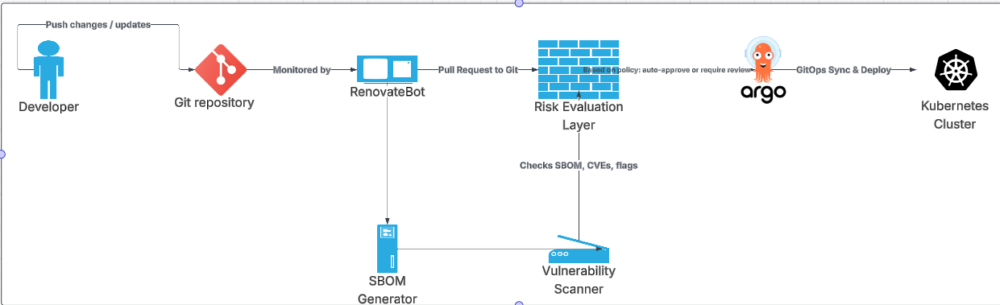

# helm-risk-pipeline

A reproducible **GitOps + risk-aware delivery** pipeline for Kubernetes.

- **Build intent:** demonstrate a pull-based delivery model (ArgoCD on AKS) where **RenovateBot** proposes dependency updates, **Syft + Trivy** produce software supply-chain signals (SBOM + CVEs), a **Risk Gate** classifies the change, and only **Low/Medium** risk changes are merged and deployed.
- **Scope:** research prototype used in a dissertation; optimized for clarity and auditability rather than enterprise hardening.

---

## 0) TL;DR for the examiner

1. **Open a PR** that updates a chart or image to a version with known **High/Critical** CVEs → **Risk Gate should fail** and block the merge.  
2. **Open a PR** that only introduces **Low/Medium** CVEs → **Risk Gate passes**, merge to `main`, **ArgoCD** reconciles to **Healthy** on AKS.  
3. Evidence artifacts are attached to each PR under **Actions → Artifacts**:  
   - `output/security/risk_summary.txt` (one-line verdict)  
   - `output/security/risk_details.md` (top CVEs, per-image details)  
   - `output/sbom/sbom.cdx.json` and `output/security/trivy-report.json`  
4. **ArgoCD** → Applications → *app name* → **History** shows the synced commit and health.

A minimal verification checklist is at the end of this README.

---

## 1) Architecture

<!-- Center + size control (uses HTML, which GitHub supports) -->
<p align="center">
  
  <br><em>Figure: GitOps flow from GitHub to ArgoCD and AKS.</em>
</p>

```
flowchart LR
  A[GitHub Repo<br/>helm-risk-pipeline] -->|PR opened| B[CI: Syft → Trivy → Risk Gate]
  B -- pass --> C[Merge to main]
  C --> D[ArgoCD<br/>in AKS (argocd ns)]
  D --> E[Workload Namespaces on AKS]
  B -- fail --> X[PR blocked<br/>(High Risk)]
```

- **Source of truth:** Git repository of Helm charts/manifests.  
- **Risk Gate:** classifies a PR using severity & CVSS from Trivy; produces `risk_summary.txt`.  
- **GitOps delivery:** ArgoCD pulls the repo and reconciles to AKS.

---

## 2) Repository layout

```
.
├── .github/workflows/         # CI workflows (Syft, Trivy, Risk Gate, artifact upload)
├── charts/                    # Example Helm charts tracked in Git
├── scripts/                   # Helper scripts (parsing, analysis, local tools)
├── output/                    # CI artifacts (sbom/, security/) – created by pipeline
│   ├── sbom/
│   └── security/
├── renovate.json              # RenovateBot configuration for dependency PRs
└── README.md
```

---

## 3) Prerequisites (local)

These are only needed if you want to run checks manually; the CI does this for PRs.

```bash
# Azure CLI (choose one)
# Ubuntu/Debian:
curl -sL https://aka.ms/InstallAzureCLIDeb | sudo bash
# macOS:
brew install azure-cli

# kubectl via az (optional helper)
az aks install-cli

# Syft (SBOM)
curl -sSfL https://raw.githubusercontent.com/anchore/syft/main/install.sh | sh

# Trivy (vulnerability scan)
curl -sfL https://raw.githubusercontent.com/aquasecurity/trivy/main/contrib/install.sh | sh
```

---

## 4) One-time cloud bootstrap (AKS + ArgoCD)

> If you already have a cluster with ArgoCD, skip to §5.

```bash
# Login and create AKS (small, student-friendly cluster)
az login
az group create --name gitops-rg --location eastus
az aks create --resource-group gitops-rg --name gitops-aks --node-count 2 --enable-managed-identity
az aks get-credentials --resource-group gitops-rg --name gitops-aks

# Install ArgoCD in-cluster (no public ingress; use port-forward)
kubectl create namespace argocd
kubectl apply -n argocd -f https://raw.githubusercontent.com/argoproj/argo-cd/stable/manifests/install.yaml

# Access ArgoCD UI locally (dev only)
kubectl port-forward svc/argocd-server -n argocd 8080:443
# Initial password:
kubectl -n argocd get secret argocd-initial-admin-secret -o jsonpath="{.data.password}" | base64 -d
```

Create an ArgoCD **Application** that points to this repo (path to your chart’s `values.yaml`):

```yaml
# argo-app.yaml (example)
apiVersion: argoproj.io/v1alpha1
kind: Application
metadata:
  name: myapp
  namespace: argocd
spec:
  project: default
  source:
    repoURL: 'https://github.com/<you>/helm-risk-pipeline'
    targetRevision: main
    path: charts/myapp
  destination:
    server: 'https://kubernetes.default.svc'
    namespace: myapp
  syncPolicy:
    automated:
      prune: true
      selfHeal: true
```
```bash
kubectl apply -f argo-app.yaml
```

---

## 5) CI/CD & GitOps flow

1. **RenovateBot** opens PRs to bump chart/images (based on `renovate.json`).  
2. **GitHub Actions** runs:  
   - **Syft** → creates `output/sbom/sbom.cdx.json`  
   - **Trivy** → creates `output/security/trivy-report.json`  
   - **Risk Gate** → classifies; writes `output/security/risk_summary.txt` & `risk_details.md`  
   - Uploads artifacts to the PR for review  
3. **Branch protection** requires **Risk Gate = success** before merge.  
4. On merge to `main`, **ArgoCD** pulls and reconciles; Application should reach **Healthy**.

---

## 6) How to demonstrate (two PRs)

### A) Show **block** behaviour (High risk)
- Edit a chart to reference an image/version with a known **Critical** or many **High** CVEs.  
- Open PR → Actions will attach `risk_summary.txt` showing e.g. `Overall Risk Level: High`.  
- **Expected:** status check **fails**; PR cannot be merged.

### B) Show **allow + deploy** (Low/Medium risk)
- Update a chart to a patch/minor that only introduces **Low/Medium** findings.  
- PR passes → merge → in ArgoCD, app revision updates and becomes **Healthy**.  
- **Evidence:** ArgoCD **History** shows the synced commit.

---

## 7) Reproducing dissertation results (optional)

The dissertation used a simple CSV log + Python script to render Chapter 5 figures (confusion matrix, CI duration, time-to-merge, ArgoCD outcomes). To reproduce:

1. For each PR, record timings & statuses in `output/results_log.csv` (columns: `risk_class, total_risk, ground_truth, ci_duration_sec, time_to_merge_min, argocd_health, image_size_mb, ...`).
2. Run the plotting script in `scripts/analysis` (requires `numpy pandas matplotlib`).
3. Generated figures are saved under `output/figures_ch5/`.

> If you want the ready-made script used during the write-up, check `scripts/analysis/generate_ch5_figs.py`.

---

## 8) Risk Gate (scoring, at a glance)

- Inputs: Trivy findings per image (severity, CVSS), SBOM package counts.  
- Score: weighted by **severity × CVSS**, with small penalties for “no-fix” CVEs.  
- Classification: **High** → block, **Low/Medium** → pass.  
- Output:  
  - `output/security/risk_summary.txt` *(one-line verdict and counts)*  
  - `output/security/risk_details.md` *(top CVEs per image with links)*

---

## 9) Branch protection (recommended)

In the GitHub repo: **Settings → Branches → Add rule** for `main`:
- Require status checks: **Risk Gate**  
- Require PR reviews (≥1)  
- (Optional) Require signed commits

---

## 10) Troubleshooting

| Symptom | Likely cause | Fix |
|---|---|---|
| PR always blocked | Risk Gate threshold too strict | Inspect `risk_details.md` for top CVEs; adjust chart/image; tune thresholds if needed |
| ArgoCD app stuck **OutOfSync** | Values drift or chart path wrong | Verify `spec.source.path` and `values.yaml`; hit **Sync** |
| ArgoCD app **Degraded** | Image not pulled / wrong namespace | Check Events tab; ensure `imagePullSecrets` and namespace exist |
| CI slow on first run | Trivy DB cold | Rerun; cache warms and subsequent scans speed up |
| AKS quota/SKU errors | Student subscription limits | Use `eastus`; choose smaller node sizes |

---

## 11) Examiner checklist (5–10 minutes)

- [ ] Open PR introducing **High/Critical** → **Risk Gate fails** (screenshot of checks + `risk_summary.txt`)  
- [ ] Open PR with **Low/Medium** only → **Risk Gate passes**  
- [ ] Merge; in **ArgoCD**, application shows **Synced / Healthy** (screenshot of **History**)  
- [ ] Verify artifacts present under **Actions → Artifacts** (`sbom.cdx.json`, `trivy-report.json`, `risk_summary.txt`, `risk_details.md`)  
- [ ] Optional: show **OutOfSync** by editing a deployment manually; ArgoCD self-heals on Sync

---

## 12) Notes & limits

- Prototype cluster: **2 nodes** (AKS). Performance on larger clusters may differ.  
- Only a subset of the full test matrix is automated here; the dissertation discusses extended tests and limitations (e.g., EPSS/KEV not yet integrated).

---

## 13) License

MIT (adjust if your institution requires a different license).

---

## 14) Acknowledgements

This project uses **ArgoCD**, **Trivy**, **Syft**, and **RenovateBot**. Thanks to their maintainers and contributors.

---

### Appendix: Useful commands

```bash
# Manually generate SBOM + Trivy (local sanity check)
./syft packages oci:my-image:tag -o cyclonedx-json > output/sbom/sbom.cdx.json
./trivy image --format json --output output/security/trivy-report.json my-image:tag

# Decode initial ArgoCD admin password (once)
kubectl -n argocd get secret argocd-initial-admin-secret -o jsonpath="{.data.password}" | base64 -d
```
